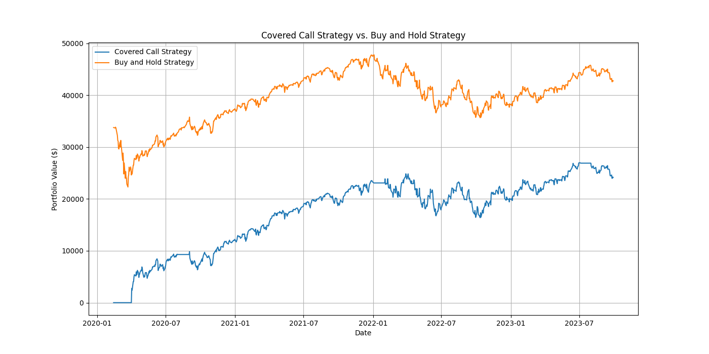

# Covered Call Options Trading Strategy in Python

## Introduction

This project implements a **Covered Call** options trading strategy using Python. The strategy is backtested using historical data of the SPDR S&P 500 ETF Trust (**SPY**) to compare its performance against a traditional buy-and-hold strategy.



## Table of Contents
<!-- TOC -->
* [Covered Call Options Trading Strategy in Python](#covered-call-options-trading-strategy-in-python)
  * [Introduction](#introduction)
  * [Table of Contents](#table-of-contents)
  * [About the Strategy](#about-the-strategy)
  * [Getting Started](#getting-started)
    * [Prerequisites](#prerequisites)
    * [Installation](#installation)
<!-- TOC -->


## About the Strategy

A **Covered Call** strategy involves:

- **Owning the Underlying Asset**: Holding shares of a stock or ETF.
- **Selling Call Options**: Writing call options on those shares to collect premiums.

**Benefits:**

- **Income Generation**: Collect premiums from selling call options.
- **Downside Protection**: Premiums can offset minor declines in the asset's price.
- **Ideal Market Conditions**: Best suited for neutral to mildly bullish markets.

**Risks:**

- **Limited Upside Potential**: If the asset's price surges above the strike price, profits are capped.
- **Stock Depreciation**: Significant declines in the asset's price can lead to losses exceeding the premiums received.

## Getting Started

### Prerequisites

- **Python**: Version 3.7 or higher.
- **Python Libraries**:
  - `numpy`
  - `pandas`
  - `yfinance`
  - `scipy`
  - `matplotlib`

### Installation

1. **Clone the Repository**

```angular2html
   git clone https://github.com/hamedasgari20/covered-call-strategy
```

2. **Create a Virtual Environment (Recommended)**
3. **Activate the virtual environment**
4. **Install Dependencies**

```
pip install numpy pandas yfinance scipy matplotlib

```
5. **Run the main script to execute the strategy simulation**

